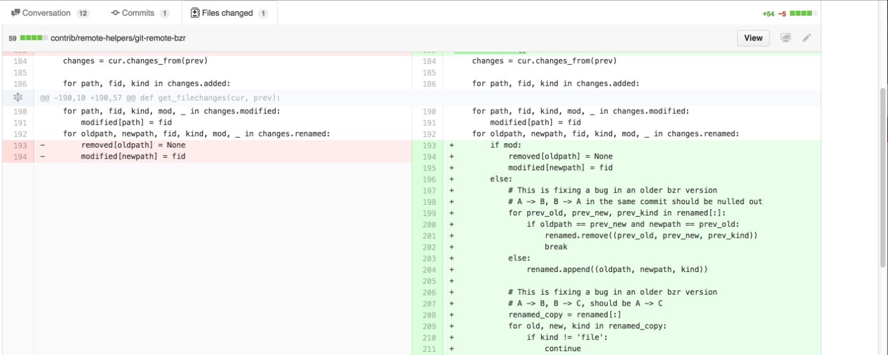

# Sticky Github Headers

[Chrome Extension](https://chrome.google.com/webstore/detail/sticky-github-headers/lfagpgloeckcpngakdpomfplbjgebjmh) that makes certain github headers always visible when scrolling down.

When viewing long pull requests on github.com it's easy to forget which file you are looking at.
This plugin makes the navigation tabs and the filename bar stick to the top of the window while scrolling down.

